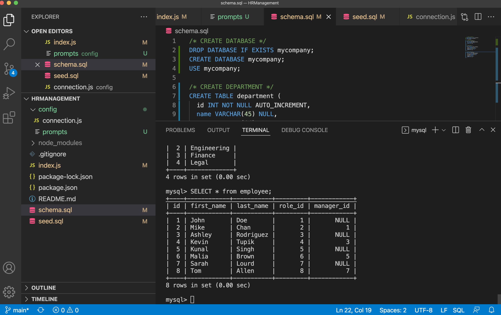

# 🖥 HRManagement
An app storing information about employees for human resource management

## 📋 Description

This project is to create a content management system (CMS) for updating the information of employees. The databse and tables are created through MySQL2 dependencies to store some key information, including the full name, the department, the role, the salary, the supervisor about every employee. The database can be updated by using command lines to create and remove any specified department, employee, and the role. A series of questions will be prompted to present questions accepting user inputs for the human resource management.

### 📽 Demonstration

Demo video: [CMS Demo](https://drive.google.com/file/d/1Eid-Duojio_dI6FLuv9aF0gnfGebJfAC/view?usp=sharing)

### 📷 Output

MySQL

## 🕹 Technologies

* [Node.js](https://nodejs.org/)
* [Inquirer.js](https://www.npmjs.com/package/inquirer)
* [MySQL2](https://www.npmjs.com/package/mysql2)
* [console.table](https://www.npmjs.com/package/console.table)

## ☎️ Questions and Links

For any questions about the project/repository please contact me @ [chentriangoes@gmail.com](mailto:chentriangoes@gmail.com)  
GitHub @ [chentriangoes](https://github.com/chentriangoes) 